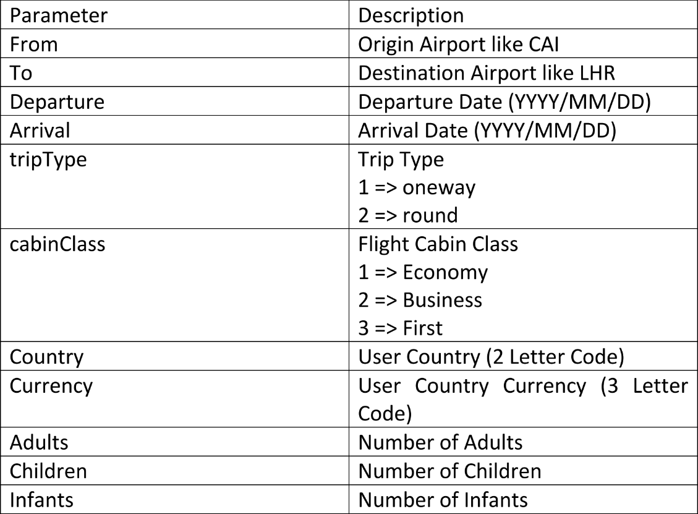
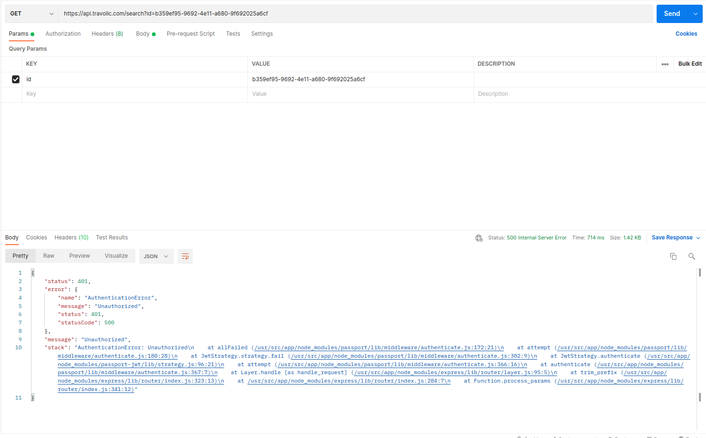
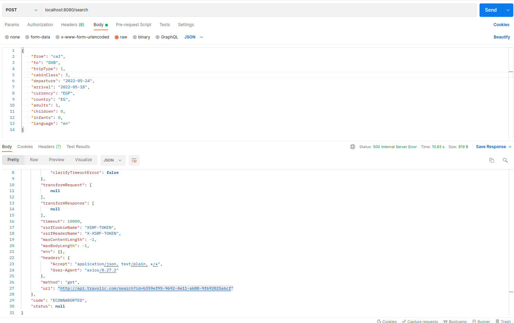
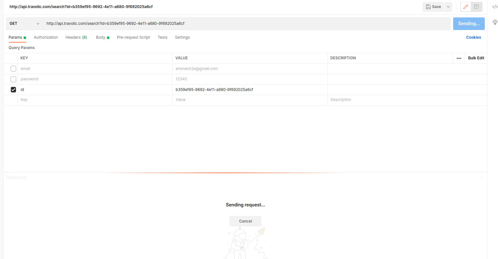

# Backend Assessment

Flight systems are very complicated nowadays, and for sure they are
very important.
To build API for these systems you must understand some general
concepts.

- `One-way flight`: A one-way flight allows you to travel only to your destination, without returning.
- `Round flight`: A round-trip flight is a flight itinerary that includes one flight to a destination and another flight back from that destination, such as flying from NYC to Paris and then Paris back to NYC.
- `Itinerary`: It’s the full route of the journey so if your flight is one-way from Cairo to Paris then this an itinerary. But if your flights is a round trip so you go from Cairo to Paris and then after some time you return to Cairo, then this full journey Cairo - Paris , Paris - Cairo is an itinerary.
- `Leg`: it’s the path of the flight, so if your are going on a one way trip from Cairo to Paris then you have one leg which is Cairo - Paris. But if you are going to a round trip, then you will have two legs, the first is Cairo - Paris and the second is Paris - Cairo.
- `Segment`: it’s the stop-points. When you travel from point to point, the plane might first land on an external point so it get some fuels or even to change the plane. For example: Cairo - Athena - Paris. This is a flight from Cairo to Paris but the plane will first land on Athena airport and the passengers will change the plane.

## Issues
- The parameters provided here are mixed between `Camel Case` and `Pascal Case` as showed in this image.

    

    According to standards we should use `Camel Case`, and here is the changes:

    | Before        | After         |
    | ------------- |:-------------:|
    | From          | from          |
    | To            | to            |
    | Departure     | departure     |
    | Arrival       | arrival       |
    | Country       | country       |
    | Currency      | currency      |
    | Country       | country       |
    | Adults        | adults        |
    | Children      | children      |
    | Infants       | infants       |

- The end-point `api.travolic.com/search?id` [GET] is broken.
    - with `http` protocol hangs doesn't and send a response.
        - I supposed it will send the 5 cheapest ticket as mentioned in the PDF so no need to handle it in the code.
    - with `https` protocol send authentication error.
    

## Hierarchy
- home
- models
- service
- routes

### Home
 A root directory which contains
- `index.ts`: the main node app (TypeScript).
- `tsconfig.json`: configuration for TypeScript compiler.
- `nodemon.json`: configuration for nodemon to run TypeScript with a help of packages included in `package.json`.
- `.env`: just an environment file.

### Models
A folder where schemas are defined there with theirs validators.
I use mongoose to make the validator and schema because it easy and powerful.
- `SearchModel.ts`: contains a schema that the server will receive.
- `ThirdPartySearchModel.ts`: contains a schema that the server will send it to the Travolic end-point.

### Routes
A Folder where the url nad routers are handled

### Service
Here we handle the internal and external services, in our case I Handled the **Travolic End-Point** only

## Setup

We use npm package manager
- Install node dependencies  `$ npm install`
- Edit **.env** file to fit your workplace.
- Run the system  `$ npm start`
